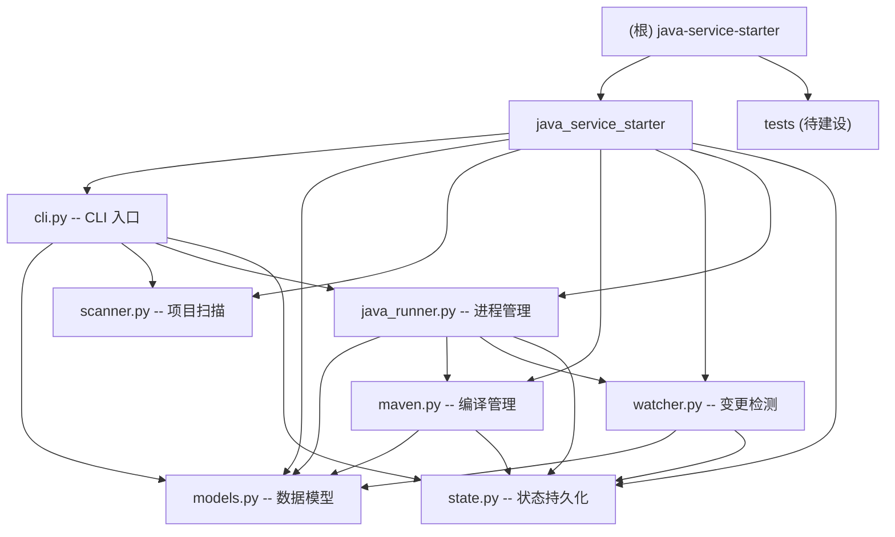

# Java Service Starter (jss)

> 通用 Java Maven 项目一键编译启动器 -- Python CLI 工具，用于管理 Java Spring Boot 服务的编译、启动、停止、清理等操作。

## 项目愿景

解决 Java Maven 多模块微服务项目在日常开发中"编译-配置-启动"流程繁琐的问题。通过 YAML 集中管理项目配置，智能检测代码变更按需编译，分离 JVM 参数与环境变量，让开发者用一条命令完成从编译到启动的全流程。

## 架构总览

采用单模块 Python 包架构，核心流程为：

1. **扫描识别** -- `scanner` 模块自动扫描 Maven 项目结构，识别服务模块、主类、端口
2. **配置加载** -- `models` 模块从 YAML 配置文件加载项目/服务/JVM/Maven 配置
3. **变更检测** -- `watcher` 模块检测源码变更，决定哪些模块需要编译
4. **编译执行** -- `maven` 模块调用 Maven 执行增量编译（`-T 1C` 并行构建）
5. **依赖拷贝** -- `java_runner` 模块在 target/lib 缺失时自动 install + copy-dependencies
6. **进程管理** -- `java_runner` 模块构建 classpath、组装 JVM 参数、启动/停止 Java 进程
7. **状态持久化** -- `state` 模块记录编译历史与启动参数，支持智能重启

### 模块结构图



## 模块索引

| 模块 | 路径 | 语言 | 说明 |
|------|------|------|------|
| [java_service_starter](java_service_starter/AGENTS.md) | `java_service_starter/` | Python | 核心包：CLI 入口、数据模型、项目扫描、Maven 编译、变更检测、进程管理、状态持久化 |

## 构建与开发

### 安装（终端用户）

```bash
uv tool install git+ssh://git@github.com/FnSGit/java-service-starter.git
```

### 开发环境

```bash
git clone git@github.com:FnSGit/java-service-starter.git
cd java-service-starter
uv venv --python 3.14
uv sync
```

### 部署

每次改完代码后执行 `make install` 使全局生效。含本地改动时用 `uv tool install . --force --no-cache`（`--no-cache` 避免使用缓存的 wheel）。

### CLI 命令

| 命令 | 用途 |
|------|------|
| `jss init [目录]` | 初始化项目配置，扫描 Maven 结构生成 config.yaml |
| `jss status [服务名]` | 查看服务运行状态（PID、环境、僵尸检测） |
| `jss envs` | 查看可用环境配置 |
| `jss start <服务> <环境>` | 启动服务（自动编译，-d 调试，-j JMX，-f 强制重启） |
| `jss build <服务> [选项]` | 仅编译不启动（--force 强制编译，--skip-deps 跳过依赖拷贝，TDD 快速迭代） |
| `jss restart <服务> [环境]` | 快速重启（复用上次参数） |
| `jss stop <服务>` | 停止服务（SIGTERM，超时后 SIGKILL） |
| `jss clear <服务>` | 清理编译产物（删除 target 目录） |
| `jss logs <服务> [环境]` | 查看服务日志（-n 指定行数，默认 500） |
| `jss history` | 查看编译/启动历史 |

### 自动编译机制

启动时自动检测编译需求，无需手动指定：
- `target/classes` 不存在 -> 自动 `compile`
- 源文件有修改但 target 还在 -> 自动 `compile`
- `target/lib` 不存在 -> 自动 `install` + `copy-dependencies` 重建依赖 jar
- 编译使用 `-T 1C` 并行构建加速

### 配置文件

- 位置：`.java-service-starter/config.yaml`（由 `jss init` 生成）
- 环境配置：`env/` 目录下的 `bootstrap-{env}.env` 或 `{prefix}-{env}.env` 文件
- 状态持久化：`.java-service-starter/state.json`

## 测试策略

当前项目**缺少测试目录和测试用例**。建议优先为以下模块补充测试：

| 优先级 | 模块 | 建议测试内容 |
|--------|------|-------------|
| P0 | `models.py` | `ProjectConfig.from_yaml()` 反序列化、`JvmConfig.build_opts()` 参数构建 |
| P0 | `state.py` | `StateManager` 序列化/反序列化、`is_compile_fresh()` 判断逻辑 |
| P1 | `scanner.py` | `_infer_service_name()` 名称推断、`_parse_yaml_port()` 端口解析 |
| P1 | `java_runner.py` | `_parse_env_file()` 环境变量分类、`build_classpath_dev()` classpath 构建 |
| P2 | `watcher.py` | `needs_compile()` 变更检测逻辑 |
| P2 | `maven.py` | `MavenConfig.build_compile_args()` 参数构建 |

## 编码规范

- Python 3.14+，使用 `from __future__ import annotations` 保持前向兼容
- 数据模型使用 `@dataclass(frozen=True, slots=True)` 不可变类
- 类型注解：使用 `str | None` 而非 `Optional[str]`，`Self` 而非泛型自引用
- CLI 输出：统一使用 Rich 库（`Console`, `Table`, `Panel`, `Progress`, `Live`）
- 配置驱动：所有可配置项通过 YAML 集中管理，不硬编码
- 进程管理：SIGTERM 优雅停止，超时后 SIGKILL 强制终止
- 状态持久化：JSON 格式，`dataclasses.asdict` 序列化

## AI 使用指引

- 修改 CLI 命令时，关注 `cli.py` 中 `main()` 的 argparse 定义与 `cmd_*` 函数的对应关系
- 新增配置项时，同步更新 `models.py` 的 dataclass 和 `ProjectConfig.from_yaml()` 方法
- 环境变量分类规则在 `java_runner.py` 的 `_parse_env_file()` 中，修改前注意 JVM 参数前缀列表
- 变更检测有两层策略：优先 `state.is_compile_fresh()`（持久化状态），回退到文件系统时间戳比较
- classpath 构建优先使用 `target/lib`（jar 拷贝），回退到 `_resolve_maven_classpath`（Maven 本地仓库路径）
- 多模块项目中 `dependency:build-classpath` 可能失败（reactor 内模块 jar 不在本地仓库），需先 `install`
- 部署：`make install` 全局生效；含本地改动时加 `--no-cache`

## 变更记录 (Changelog)

| 时间 | 操作 | 说明 |
|------|------|------|
| 2026-07-12 14:57 | 功能增强 | 新增 `build` 子命令（仅编译不启动）；提取 `build_service()` 函数，`start_service` 复用编译逻辑；支持 `--force` 和 `--skip-deps` 选项 |
| 2026-05-15 09:30 | 功能增强 | 新增 `logs` 命令；自动编译机制（去掉 `-b`）；`status` 替代 `services`；`-T 1C` 并行构建；`_copy_dependencies` 依赖拷贝 |
| 2026-05-14 21:45 | 初始创建 | 首次生成项目 AI 上下文文档，覆盖全部 7 个源文件 |
