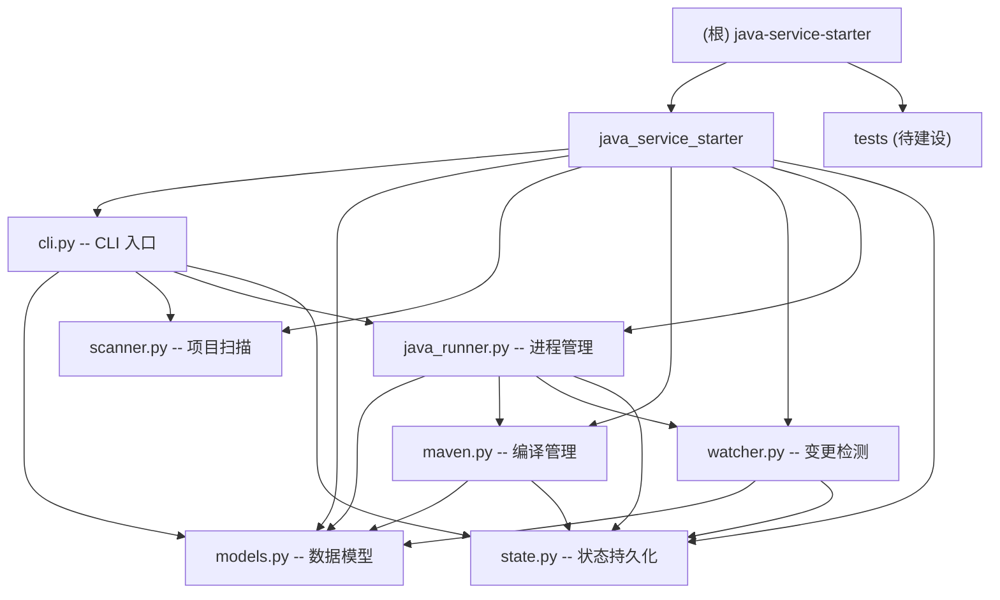

# Java Service Starter (jss)

> 通用 Java Maven 项目一键编译启动器 -- Python CLI 工具，用于管理 Java Spring Boot 服务的编译、启动、停止、清理等操作。

## 项目愿景

解决 Java Maven 多模块微服务项目在日常开发中"编译-配置-启动"流程繁琐的问题。通过 YAML 集中管理项目配置，智能检测代码变更按需编译，分离 JVM 参数与环境变量，让开发者用一条命令完成从编译到启动的全流程。

## 架构总览

采用单模块 Python 包架构，核心流程为：

1. **扫描识别** -- `scanner` 模块自动扫描 Maven 项目结构，识别服务模块、主类、端口
2. **配置加载** -- `models` 模块从 YAML 配置文件加载项目/服务/JVM/Maven 配置
3. **变更检测** -- `watcher` 模块检测源码变更，决定哪些模块需要编译
4. **编译执行** -- `maven` 模块调用 Maven 执行增量编译
5. **进程管理** -- `java_runner` 模块构建 classpath、组装 JVM 参数、启动/停止 Java 进程
6. **状态持久化** -- `state` 模块记录编译历史与启动参数，支持智能重启

### 模块结构图



## 模块索引

| 路径 | 职责 | 关键类/函数 |
|------|------|-------------|
| `java_service_starter/cli.py` | CLI 入口，命令分发 | `main()`, `cmd_start()`, `cmd_stop()`, `cmd_restart()`, `cmd_init()`, `cmd_status()`, `cmd_envs()`, `cmd_history()`, `cmd_clear()` |
| `java_service_starter/models.py` | 数据模型定义 | `ServiceConfig`, `JavaConfig`, `JvmConfig`, `MavenConfig`, `ProjectConfig` |
| `java_service_starter/scanner.py` | Maven 项目自动扫描 | `ProjectScanner`, `ScannedService`, `scan_project()` |
| `java_service_starter/maven.py` | Maven 编译执行 | `compile_module()`, `auto_compile()` |
| `java_service_starter/watcher.py` | 源码变更检测 | `needs_compile()` |
| `java_service_starter/java_runner.py` | Java 进程生命周期管理 | `start_service()`, `stop_service()`, `is_running()`, `find_pid()`, `get_service_status()`, `clear_service()`, `load_env()`, `build_classpath_dev()` |
| `java_service_starter/state.py` | 编译/启动状态持久化 | `StateManager`, `ProjectState`, `CompileRecord`, `StartRecord` |

## 部署

每次改完代码后：开发时用 editable 模式调试，稳定后执行 `make install` 使全局生效。

## 运行与开发

### 安装（终端用户）

```bash
uv tool install git+ssh://git@github.com/FnSGit/java-service-starter.git
```

### 开发环境

```bash
git clone git@github.com:FnSGit/java-service-starter.git
cd java-service-starter
uv venv --python 3.14
uv sync
```

### CLI 命令

| 命令 | 用途 |
|------|------|
| `jss init [目录]` | 初始化项目配置，扫描 Maven 结构生成 config.yaml |
| `jss status [服务名]` | 查看服务列表和运行状态 |
| `jss envs` | 查看可用环境配置 |
| `jss start <服务> <环境> -b` | 一键编译启动（-d 调试，-j JMX，-f 强制重启） |
| `jss restart <服务> [环境]` | 快速重启（复用上次参数） |
| `jss stop <服务>` | 停止服务（SIGTERM，超时后 SIGKILL） |
| `jss clear <服务>` | 清理编译产物（删除 target 目录） |
| `jss history` | 查看编译/启动历史 |

### 配置文件

- 位置：`.java-service-starter/config.yaml`（由 `jss init` 生成）
- 环境配置：`env/` 目录下的 `bootstrap-{env}.env` 或 `{prefix}-{env}.env` 文件
- 状态持久化：`.java-service-starter/state.json`

## 测试策略

当前项目**缺少测试目录和测试用例**。建议优先为以下模块补充测试：

| 优先级 | 模块 | 建议测试内容 |
|--------|------|-------------|
| P0 | `models.py` | `ProjectConfig.from_yaml()` 反序列化、`JvmConfig.build_opts()` 参数构建 |
| P0 | `state.py` | `StateManager` 序列化/反序列化、`is_compile_fresh()` 判断逻辑 |
| P1 | `scanner.py` | `_infer_service_name()` 名称推断、`_parse_yaml_port()` 端口解析 |
| P1 | `java_runner.py` | `_parse_env_file()` 环境变量分类、`build_classpath_dev()` classpath 构建 |
| P2 | `watcher.py` | `needs_compile()` 变更检测逻辑 |
| P2 | `maven.py` | `MavenConfig.build_compile_args()` 参数构建 |

## 编码规范

- Python 3.14+，使用 `from __future__ import annotations` 保持前向兼容
- 数据模型使用 `@dataclass(frozen=True, slots=True)` 不可变类
- 类型注解：使用 `str | None` 而非 `Optional[str]`，`Self` 而非泛型自引用
- CLI 输出：统一使用 Rich 库（`Console`, `Table`, `Panel`, `Progress`, `Live`）
- 配置驱动：所有可配置项通过 YAML 集中管理，不硬编码
- 进程管理：SIGTERM 优雅停止，超时后 SIGKILL 强制终止
- 状态持久化：JSON 格式，`dataclasses.asdict` 序列化

## AI 使用指引

- 修改 CLI 命令时，关注 `cli.py` 中 `main()` 的 argparse 定义与 `cmd_*` 函数的对应关系
- 新增配置项时，同步更新 `models.py` 的 dataclass 和 `ProjectConfig.from_yaml()` 方法
- 环境变量分类规则在 `java_runner.py` 的 `_parse_env_file()` 中，修改前注意 JVM 参数前缀列表
- 变更检测有两层策略：优先 `state.is_compile_fresh()`（持久化状态），回退到文件系统时间戳比较
- classpath 构建优先使用 Maven 解析的顺序（`_resolve_maven_classpath`），回退到字母排序
- 部署：开发时 editable 模式调试，稳定后 `make install` 全局生效

## 变更记录 (Changelog)

| 时间 | 操作 | 说明 |
|------|------|------|
| 2026-05-14 21:45 | 初始创建 | 首次生成项目 AI 上下文文档，覆盖全部 7 个源文件 |
